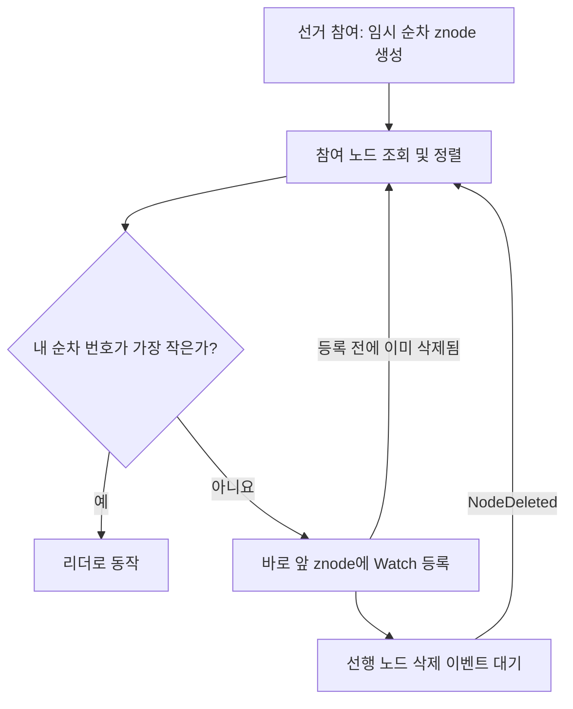

<div align="center">

# 🧭 Distributed Systems with ZooKeeper

### Java로 살펴보는 분산 조정과 리더 선출

**ZooKeeper API · Watcher Events · Leader Election · Re-election**


여러 프로세스가 리더를 정하고, znode의 변화를 감지하며, 리더 이탈에 대응하는 과정을 학습합니다.

[프로젝트 소개](#-프로젝트-소개) · [예제 구성](#-예제-구성) · [재선출 구조](#-재선출-구조) · [실행 방법](#-실행-방법)

</div>

---

## 📘 프로젝트 소개

Apache ZooKeeper의 Java API를 사용하여 **분산 애플리케이션의 조정(coordination)** 원리를 실습하는 저장소입니다.

기본 리더 선출에서 시작해 znode 이벤트를 관찰하고, 선행 노드 삭제를 감지하여 리더를 다시 선출하는 방식으로 확장합니다. 세 예제는 각각 독립적인 Maven 프로젝트입니다.

> 여기서 선출하는 리더는 **애플리케이션 인스턴스의 리더**입니다. ZooKeeper 서버 앙상블 내부의 리더 선출 알고리즘을 직접 구현한 프로젝트는 아닙니다.

## 🗂️ 예제 구성

| 단계 | 모듈 | 핵심 내용 | 진입 클래스 |
| :---: | --- | --- | --- |
| **01** | [`zookeeper-api-introduction`](zookeeper-api-introduction) | 연결, 임시 순차 znode 생성, 최초 리더 결정 | `LeaderElection` |
| **02** | [`watchers`](watchers) | znode 생성·삭제·데이터·자식 목록 변경 감지 | `WatchersDemo` |
| **03** | [`leader-reelection`](leader-reelection) | 선행 znode 감시 및 삭제 이벤트 기반 재선출 | `LeaderElection` |

### 01 · ZooKeeper API 기초

[`LeaderElection.java`](zookeeper-api-introduction/src/main/java/LeaderElection.java)

- `localhost:2181`의 ZooKeeper 서버에 연결합니다.
- `/election/c_` 접두사로 `EPHEMERAL_SEQUENTIAL` znode를 생성합니다.
- 참여 노드를 정렬하여 순차 번호가 가장 작은 인스턴스를 리더로 판단합니다.
- 연결 상태와 선출 결과를 콘솔에 출력합니다.

이 예제는 시작 시 한 번 리더를 결정합니다. 선거 노드 변경을 구독하지 않으므로 리더 이탈 후 자동 재선출은 다음 예제에서 다룹니다.

### 02 · Watcher 이벤트

[`WatchersDemo.java`](watchers/src/main/java/WatchersDemo.java)

`/target_znode`를 대상으로 `exists()`, `getData()`, `getChildren()`에 Watch를 등록합니다.

| 이벤트 | 관찰 대상 |
| --- | --- |
| `NodeCreated` | 대상 znode 생성 |
| `NodeDeleted` | 대상 znode 삭제 |
| `NodeDataChanged` | 대상 znode의 데이터 변경 |
| `NodeChildrenChanged` | 대상 znode의 자식 목록 변경 |

이벤트 처리 후 `watchTargetZnode()`를 다시 호출하여 Watch를 재등록합니다. 대상이 없으면 존재 여부 Watch를 남기고 반환합니다.

### 03 · 리더 재선출

[`LeaderElection.java`](leader-reelection/src/main/java/LeaderElection.java)

- 가장 작은 순차 번호를 가진 인스턴스가 리더가 됩니다.
- 나머지 인스턴스는 **자신의 바로 앞 순서에 있는 znode**를 감시합니다.
- 선행 znode가 삭제되면 `reelectLeader()`를 다시 실행합니다.
- 감시를 등록하려는 사이에 선행 노드가 사라졌다면 목록 조회와 선택을 반복합니다.

## 🔄 재선출 구조



재선출은 기존 선거 znode를 기준으로 진행하며, 이벤트마다 새 선거 znode를 만들지는 않습니다. 모든 참여자가 리더 하나를 감시하는 대신 선행 노드를 나누어 감시합니다.

## 🧠 핵심 개념

| 개념 | 이 프로젝트에서의 사용 |
| --- | --- |
| **Persistent znode** | `/election`과 같은 부모 경로를 유지 |
| **Ephemeral znode** | 클라이언트 세션에 연결된 선거 참여 정보 |
| **Sequential znode** | 참여 노드에 순서를 부여하여 리더 결정 |
| **Watcher** | 변경 이벤트를 콜백으로 전달 |
| **Session** | 연결 및 임시 노드의 생명주기 관리 |
| **Predecessor Watch** | 바로 앞 순서의 노드만 감시하여 재선출 계기 제공 |

임시 znode는 세션 종료 또는 만료 시 제거됩니다. 네트워크가 잠시 끊겼다고 즉시 삭제되는 것으로 해석하면 안 됩니다. 코드의 `30000 ms`는 클라이언트가 요청하는 세션 타임아웃입니다.

## 🚀 실행 방법

### 1. 준비 환경

- JDK 17
- Maven
- `localhost:2181`에서 실행 중인 ZooKeeper 서버
- 애플리케이션과 ZooKeeper CLI를 각각 실행할 터미널

각 `pom.xml`은 Java 17을 대상으로 하며 ZooKeeper 클라이언트 `3.4.12`를 참조합니다. 서버 설치 파일은 이 저장소에 포함되어 있지 않습니다.

ZooKeeper 서버의 `zoo.cfg`에는 실제 사용할 데이터 디렉터리와 클라이언트 포트를 설정합니다. 단일 서버 실습용 설정 예시입니다.

```properties
tickTime=2000
dataDir=/path/to/zookeeper-data
clientPort=2181
```

`dataDir`은 환경에 맞는 실제 경로로 바꾸고 디렉터리를 준비합니다. 서버를 시작한 뒤 `zkCli.sh` 또는 Windows의 `zkCli.cmd`로 접속합니다.

### 2. 저장소 내려받기

```powershell
git clone https://github.com/path0971/distributed-system-zookeeper.git
cd distributed-system-zookeeper
```

루트에는 통합 `pom.xml`이 없으므로 **각 모듈 폴더에서 빌드**합니다.

### 3. 선거 경로 준비

ZooKeeper CLI에서 실행합니다.

```text
create /election ""
ls /election
```

`/election`이 이미 있으면 재생성할 필요가 없습니다. 두 리더 선출 예제는 이 부모 경로를 자동으로 생성하지 않습니다.

### 4. 기본 리더 선출 실행

저장소 루트에서:

```powershell
cd zookeeper-api-introduction
mvn clean package
java -jar target/leader.election-1.0-SNAPSHOT-jar-with-dependencies.jar
```

별도 터미널에서 같은 모듈의 JAR을 추가 실행하면, 기존 선거 참여자가 없는 상태에서 먼저 참여한 인스턴스는 리더, 이후 인스턴스는 비리더로 표시됩니다.

### 5. Watcher 실행

별도 터미널의 저장소 루트에서:

```powershell
cd watchers
mvn clean package
java -cp target/watchers-1.0-SNAPSHOT-jar-with-dependencies.jar WatchersDemo
```

> 현재 `watchers/pom.xml`의 manifest 진입점은 `LeaderElection`으로 지정되어 있지만 실제 클래스는 `WatchersDemo`입니다. 위 명령은 `-cp`로 실제 클래스를 지정하여 실행합니다. `java -jar`를 사용하려면 POM의 `mainClass`를 `WatchersDemo`로 수정한 뒤 다시 빌드해야 합니다.

대상 경로가 없는 실습 환경에서, ZooKeeper CLI의 아래 명령을 **한 줄씩 실행하고 애플리케이션 로그를 확인**합니다.

```text
create /target_znode "hello"
set /target_znode "updated"
create /target_znode/child "sample"
delete /target_znode/child
delete /target_znode
```

각 단계에서 생성, 데이터 변경, 자식 목록 변경, 삭제 로그를 관찰합니다. Watch는 이벤트마다 재등록되므로 모든 중간 상태를 빠짐없이 기록하는 이벤트 로그와는 다릅니다.

### 6. 리더 재선출 실행

기본 선출 예제의 인스턴스를 모두 종료한 뒤 진행합니다. 두 예제는 같은 `/election` 경로를 사용합니다.

저장소 루트에서:

```powershell
cd leader-reelection
mvn clean package
java -jar target/leader.election-1.0-SNAPSHOT-jar-with-dependencies.jar
```

동일한 JAR을 터미널 3개에서 실행합니다. 각 인스턴스의 역할을 확인하고, 리더 터미널에서 `Ctrl + C`로 종료합니다.

| 확인 단계 | 예상 관찰 결과 |
| --- | --- |
| 인스턴스 참여 | `/election/c_…` 생성 및 노드 이름 출력 |
| 비리더 인스턴스 | `Watching znode ...` 출력 |
| 리더 종료 | 세션 종료·만료로 해당 임시 znode 제거 |
| 후속 인스턴스 | 삭제 이벤트 수신 후 `I am the leader` 출력 |

강제 종료 후 반영 시간은 ZooKeeper 세션 처리에 따라 달라질 수 있습니다. 로그 문구는 코드 기준이며, 이 README 작성 과정에서 서버를 띄워 실측한 결과는 아닙니다.

## 🛠️ 실행 시 확인할 점

| 증상 | 확인 사항 |
| --- | --- |
| `/election` 관련 `NoNode` | ZooKeeper CLI에서 부모 경로 생성 |
| 연결 실패 | 서버 실행 상태, `localhost:2181`, `clientPort` 확인 |
| Java release 관련 빌드 오류 | `java -version`, `mvn -version`으로 Maven이 사용하는 JDK 확인 |
| Watcher의 메인 클래스 오류 | `java -cp ... WatchersDemo` 사용 또는 POM 진입점 수정 |
| 예상과 다른 리더 | 같은 `/election`에 참여한 다른 예제·프로세스 확인 |

## 📝 구현 범위

- 연결 상태 이벤트에서 `SyncConnected` 이외의 상태를 받으면 대기를 해제하고 종료하는 흐름입니다. 자동 세션 복구는 구현되어 있지 않습니다.
- 일부 Watcher 콜백의 예외 처리 블록은 비어 있습니다. 상세 오류 기록과 재시도 정책은 확장할 수 있습니다.
- 선거 znode는 `OPEN_ACL_UNSAFE`로 생성합니다. 인증과 ACL을 적용한 운영용 구성은 포함하지 않습니다.
- API 기초 예제의 `System.out.flush()`는 출력 버퍼를 비우는 용도이며, 네트워크나 세션 오류를 복구하는 기능은 아닙니다.

## 🔗 연관 프로젝트

**[Service Registry & Discovery](https://github.com/path0971/service-registry-discovery)** — 리더 선출을 워커 주소 등록과 서비스 목록 변경 감지로 확장한 별도 프로젝트입니다.

---

<div align="center">

**Learn Distributed Coordination, One znode at a Time.**<br>
연결 · 이벤트 감지 · 리더 선출 · 재선출

</div>
